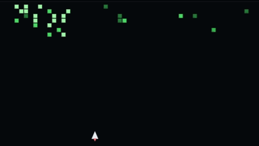

# 👋 Hey, I'm Sai Sambhu Prasad Kalaga

**AI Engineer Trainee @ iLink Digital | Former Data Science RA @ SMU | Former NLP and ML @ Blue Clay Health | Full-Stack Dev | AI Engineer | Ex-GDSC Lead | MSCS @ SMU (Dallas)**  
📍 Austin, TX | 💬 Let’s talk AI, ML, NLP, Data, or just cool side projects!

---
## 🎮 Contributions Blaster

Shoot my GitHub contribution blocks from the last year (auto-synced).

👉 Play here: https://YOUR_USERNAME.github.io/YOUR_REPO/

---
## 🚀 A Quick Glimpse

I'm a full-spectrum builder with a strong brain for AI and a soft spot for clean, useful tech. My background cuts across:
- 🤖 Deep Learning, NLP & LLMs
- 🔎 Retrieval-Augmented Generation (RAG)
- 🌐 Full-Stack Web Development
- 📊 Data Analytics & Visualization
- ☁️ Cloud Infrastructure

Right now, I'm helping build scalable Agentic AI solutions at iLink Digital. Previously, I worked on AI and ML research at the [SMU Center for Global Health Impact](https://www.smu.edu/globalhealthimpact).

---
## 🧩 Skills
### 👨‍💻 Programming

       

### 🌐 Frameworks and Web

         

### 🗄️ Databases and Warehouses

      

### 📊 BI and Analytics

     

### ☁️ Cloud and Dev

        

### 🤖 AI and ML Toolkit

                   

### 🧪 Product and Experimentation

       

### 📐 Math Foundations
Linear Algebra • Calculus • Statistics • Probability
---

## 🧠 What I’ve Built (So Far)

### 🔬 Research & Real-World AI
- **95% accurate surgical performance predictor** using Random Forest, deployed in a VR-based training simulator  
- **LLM-powered chatbot** w/ semantic search using FAISS + Google Gemini  
- **Out-of-tune audio detector** using VGGish + CNN for music signal processing  
- **Crime heatmaps in Dallas** with R-based geo-visualization  
- **Telehealth optimization models** for Parkland Hospitals

### 🛠️ Past Work
- 📈 Boosted ad campaign CTR by 25% at a digital marketing startup with predictive ML  
- 🧾 Built NLP tools to extract structured insights from financial reports at ISB  
- 🧑‍🏫 Taught 1000+ students through Google Developer Student Club, hosted 30+ tech events, led GDSC WoW Hyderabad  

---

## 🎓 Education

- 🎓 **M.S. in Computer Science**, Southern Methodist University, Dallas (2025)  
- 🎓 **B.Tech in CSE**, Anurag University (2023)

---

## 🏆 Awards, Certs, & Stuff That Makes Me Smile

- 🥇 Winner, IBM TechHack  
- 🧠 Microsoft Technology Associate – Python  
- 🧠 Data Visualisation - Havard
- 🎓 SMU Lyle Graduate Scholar  
- 📄 Published: *Object Detection for Visually Impaired Using ML & Flutter*

---

## 🌍 What Else?

I’ve lived in Oman 🇴🇲, explored UAE 🇦🇪, and now I’m coding life in the USA 🇺🇸. Fun fact? I once worked on a robotic lunar rover project after visiting NASA Kennedy Space Center 🚀.

---

## 📫 Let’s Connect

- 💼 [LinkedIn](https://www.linkedin.com/in/sai-sambhu-prasad-kalaga)
- 📨 saisambhuprasadkalaga@gmail.com  

---

## ⚡️ Currently...

- Learning: Reinforcement Learning & Advanced Graph ML  
- Hunting: Meaningful, high-impact roles in AI/ML/Data Science  
- Open to: Collaborations, research, good memes

---

> _“Build for impact, scale with purpose, and never stop learning.”_  
